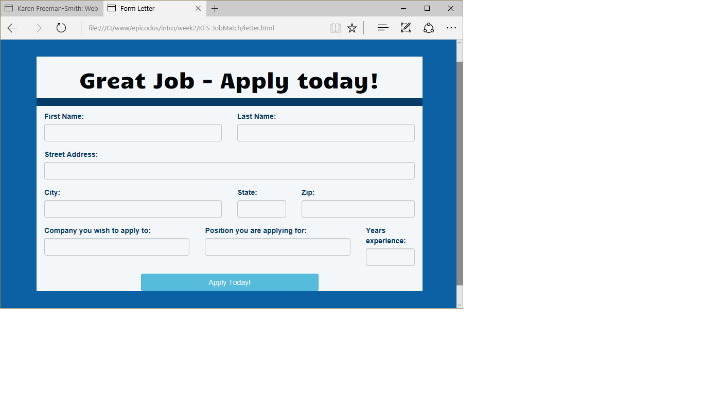

# Job Match
Version 0.2.0: June 30, 2016
by [Karen Freeman-Smith](https://karenfreemansmith.github.io)

### Technologies Used
HTML, CSS/Sass, Bootstrap, JavaScript, jQuery, Gulp

## Description
*[Learn How To Program](http://learnhowtoprogram.com) Intro to Programming Week 2 Individual Project: An application form that returns a nice "thanks for applying, but no thanks letter".*

* Version 0.2.0 - add sass and gulpfile for development, extend site with pages for job board

## Setup/Installation
* [View on Github Pages](https://karenfreemansmith.github.io/LHP-IntroWk2-Chatbot)
* _OR_
* Clone directory
* Open index.html in your favorite browser
* Run "npm install" to setup development environment for further improvements
* Run "gulp serve" to watch for changes and see them live

## Support & Contact
For questions, concerns, or suggestions please email karenfreemansmith@gmail.com

## Known Issues
* Wrote specs and skeleton for job board, but pages are not functional yet.

## Legal
*Licensed under the GNU General Public License v3.0*

Copyright (c) 2016 Copyright _[Karen Freeman-Smith](https://karenfreemansmith.github.io)_ All Rights Reserved.
